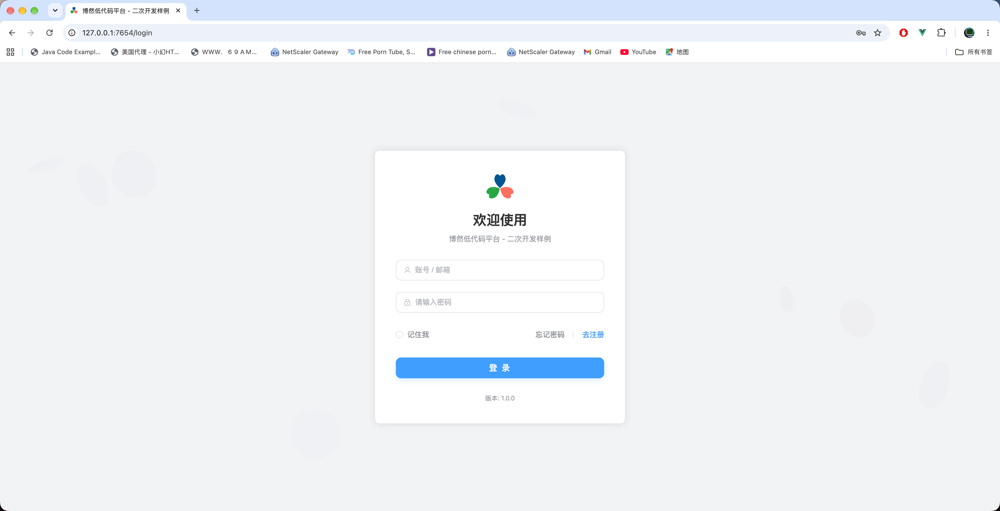
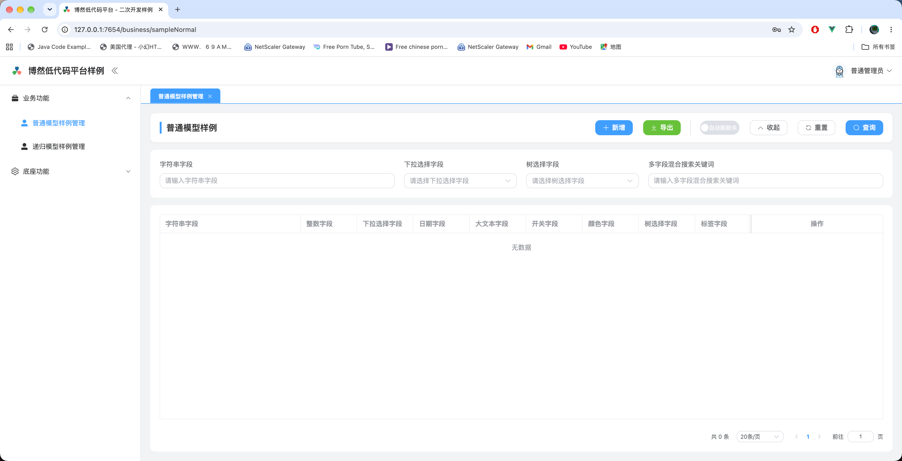
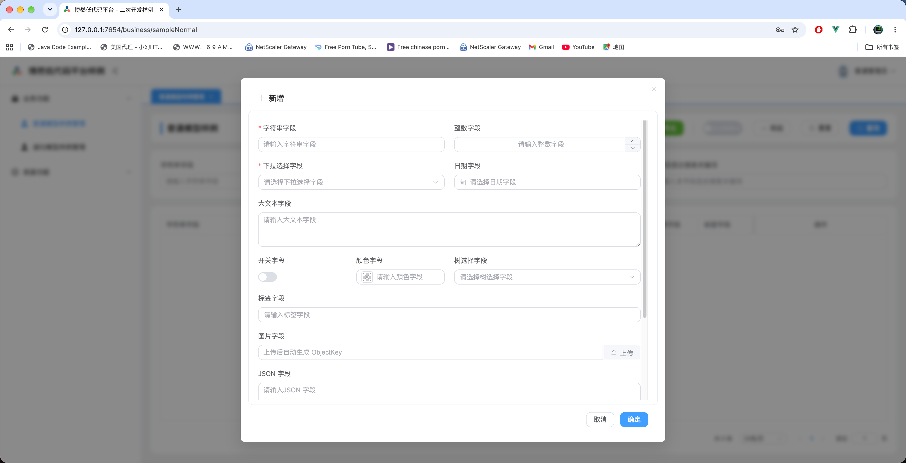
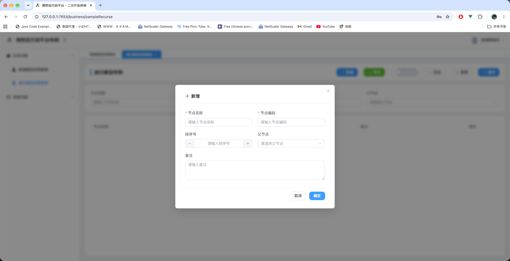
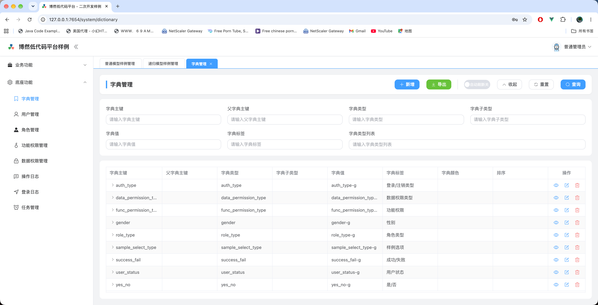

# brtech-fusion 二次开发样例

本仓库演示基于 brtech-fusion 2.0 开发业务系统的两种方式：直接使用底座内置前端，以及维护自己的 Vue 前端。两套样例均包含普通表单、树形数据、字典、权限和初始化数据，可独立运行。

## 选择一种方式

| 对比项 | 不定制前端 | 定制前端 |
| --- | --- | --- |
| 目录 | `without_custom_frontend/` | `with_custom_frontend/` |
| 界面来源 | Python 底座包内置的管理界面 | 本项目 Vue 应用与 `brtech-fusion` 前端插件 |
| 主要开发语言 | Python | Python、TypeScript、Vue |
| 通用 CRUD 页面 | 后端模型注解驱动 | 同样由后端模型注解驱动 |
| 是否需要 Node.js | 不需要 | 开发和构建前端需要 |
| 前端扩展方式 | 调整字段、页面、菜单、主题及品牌资源 | 在上述能力之外，自定义路由、页面和布局 |
| 发布内容 | 后端、配置、fixtures、品牌资源 | 后端、配置、fixtures、前端构建产物 |
| 详细文档 | [不定制前端 README](without_custom_frontend/README.md) | [定制前端 README](with_custom_frontend/README.md) |

定制前端并不意味着要重写所有表格和表单：当前 Vue 样例直接嵌入 `AdminLayout`，继续复用底座的通用管理能力。

## 界面预览

以下截图展示样例的登录、普通模型、递归模型和字典管理界面。截图使用根路径部署，具体访问地址以所选样例的配置为准。

### 登录页面

应用登录入口，展示品牌标识、账号密码登录、注册与找回密码入口。



### 普通模型列表

由模型配置生成的列表与查询区域，包含字符串、下拉选择、树选择和多字段混合搜索。



### 普通模型新增表单

展示文本、数字、下拉选择、日期、开关、颜色、树选择、标签、图片上传和 JSON 等字段组件。



### 递归模型新增表单

通过节点名称、节点编码、排序号和父节点配置树形数据。



### 字典管理

底座内置字典管理界面，展示样例选项、用户状态、是/否等字典及查询、维护入口。



## 仓库结构

```text
brtech-fusion-sample/
├── README.md
├── docs/screenshots/             # README 界面截图
├── pyproject.toml                 # 仓库 Python 版本声明，不包含后端完整依赖
├── without_custom_frontend/
│   ├── main.py                   # 应用入口、系统模块与业务路由注册
│   ├── app/                      # config/models/crud/schemas/services/routers
│   ├── fixtures/                 # 字典、用户、角色、菜单、权限、Excel 模板
│   ├── static/                   # 覆盖底座品牌资源
│   ├── .env                      # 本地运行配置
│   ├── requirements.in / requirements.txt
│   └── build_pex.sh               # PEX 打包参考脚本
└── with_custom_frontend/
    ├── app_backend/              # 与上面同结构的独立后端
    └── app_frontend/             # Vue 3 + TypeScript + Vite
        ├── src/                  # 插件安装、路由、布局及 API 示例
        ├── public/static/        # 随构建复制的品牌资源
        └── vite.config.ts        # 代理及后端 static 输出目录
```

两套后端需要分别安装依赖、分别启动；不要把它们当作同一个服务的两个启动入口。两者当前端口相同，同时运行时应修改其中一套的 `PORT`。

## 环境与依赖准备

- Python：仓库声明 `>=3.11`；所用底座 wheel 及其依赖也必须支持选用的 Python 版本。
- 定制前端：Node.js `^20.19.0 || >=22.12.0`，以及 npm。
- 数据库：样例默认 SQLite，也在配置中提供 PostgreSQL 连接示例。
- 对象存储：入口注册了 MinIO 存储客户端；图片上传等功能需要可用的 OSS 配置。
- 邮件、支付、AI：按实际启用的功能配置对应服务，注册了模块不代表外部服务已可用。

### 本地底座依赖

当前依赖引用的是开发机上的本地文件，并非可直接从公共仓库安装的版本声明：

| 位置 | 引用 |
| --- | --- |
| 两套后端的 `requirements.in` 和 `requirements.txt` | `brtech_fusion-2.0.0-py3-none-any.whl` 的本地 `file://` 路径 |
| `app_frontend/package.json` | `brtech-fusion-2.0.0.tgz` 的本地 `file://` 路径 |

换机器时，先取得对应版本的 wheel 和 tgz。将后端 `requirements.in` 的文件路径改为实际位置，再生成依赖清单；也可同步修改 `requirements.txt` 中的底座文件引用，保留其他锁定版本。不要只改 `.in` 却继续安装旧的 `.txt`。

如使用 uv，在各自后端目录执行：

```bash
uv pip compile requirements.in -o requirements.txt
uv pip install -r requirements.txt
```

前端可在 `app_frontend` 目录执行 `npm install /实际路径/brtech-fusion-2.0.0.tgz`，更新包引用与锁文件。已有锁文件也可能引用旧机器的路径，迁移后应检查。根目录 `pyproject.toml` 的依赖列表为空，不能代替后端 `requirements.txt`。

## 快速开始

### 不定制前端

从仓库根目录执行；先完成上面的底座依赖路径调整：

```bash
cd without_custom_frontend
python3 -m venv .venv
source .venv/bin/activate
python -m pip install -r requirements.txt
mkdir -p var
python main.py
```

按当前 `.env`，打开 [管理界面](http://127.0.0.1:7654/) 和 [API 文档](http://127.0.0.1:7654/docs)。管理界面的登录路由由内置前端处理。

### 定制前端：构建后由后端统一提供服务

从仓库根目录执行：

```bash
cd with_custom_frontend/app_frontend
npm install
npm run build
cd ../app_backend
python3 -m venv .venv
source .venv/bin/activate
python -m pip install -r requirements.txt
mkdir -p var
python main.py
```

`npm install` 前需修正前端本地 tgz 引用。构建输出到 `app_backend/static/`。按当前 `.env`，打开 [定制前端登录页](http://127.0.0.1:7654/console/login) 和 [API 文档](http://127.0.0.1:7654/docs)。

上面的虚拟环境激活命令适用于 macOS/Linux；Windows PowerShell 使用 `.venv\Scripts\Activate.ps1`。

## 配置与访问路径

配置定义在各后端的 `app/config.py`。底座通过 Pydantic Settings 读取进程环境变量和当前工作目录的 `.env`；常规优先级为：进程环境变量 > `.env` > 配置类默认值。请在包含 `main.py` 的后端目录启动，以便正确定位 `.env`、`fixtures/`、`static/` 和相对数据库路径。

| 配置 | Python 默认值 | 当前两套 `.env` 的覆盖值 |
| --- | --- | --- |
| `PORT` | `9876` | `7654` |
| `CONTEXT_PATH` | `/sample` | `/`，规范化为空前缀 |
| `UI_PATH` | `/frontend` | `/`，规范化为空前缀 |
| `API_PREFIX` | `/api/v1` | 未覆盖 |
| `DATABASE_URL` | `sqlite+aiosqlite:///var/sample.db` | 未覆盖 |
| `INIT_DATA_DIR` | `fixtures` | 未覆盖 |

`sqlite+aiosqlite:///var/sample.db` 指向工作目录下的 `var/sample.db`，不是系统 `/var/sample.db`。

地址组合规则：

```text
界面基址 = CONTEXT_PATH + UI_PATH
业务 API = CONTEXT_PATH + API_PREFIX + RouterMeta.prefix + 接口路径
API 文档 = CONTEXT_PATH + /docs        （使用默认 DOCS_URL 时）
定制前端登录页 = 界面基址 + /console/login
```

| 入口 | 当前 `.env` | 仅使用 Python 默认配置 |
| --- | --- | --- |
| UI | `http://127.0.0.1:7654/` | `http://127.0.0.1:9876/sample/frontend/` |
| 定制前端登录 | `http://127.0.0.1:7654/console/login` | `http://127.0.0.1:9876/sample/frontend/console/login` |
| 普通模型分页 | `/api/v1/sampleNormal/query/page` | `/sample/api/v1/sampleNormal/query/page` |
| API 文档 | `/docs` | `/sample/docs` |

API 文档路径不包含 `API_PREFIX`。`ROOT_PATH` 涉及代理部署，不能简单当作业务 API 前缀使用。

其他主要配置：

| 配置组 | 用途 |
| --- | --- |
| `TITLE`、`LOGO`、`LOGIN_TITLE`、`LOGIN_SUBTITLE` | 应用与登录页品牌展示 |
| `THEME_NAME`、`THEME_PRIMARY_COLOR`、`THEME_BORDER_RADIUS` | 界面主题 |
| `DATABASE_URL` | 数据库连接 |
| `JWT_SECRET_KEY` | 登录令牌密钥 |
| `STATIC_API_KEYS` | fixtures 初始化请求使用的静态鉴权配置 |
| `OSS_ENDPOINT`、`OSS_ACCESS_KEY`、`OSS_SECRET_KEY`、`OSS_BUCKET_NAME`、`OSS_SECURE` | 对象存储 |
| `MAIL_ENABLE` 与 `MAIL_*` | 注册、找回密码等邮件能力 |
| `ENABLE_FUNC_PERMISSION_VALIDATION`、`ENABLE_DATA_PERMISSION_VALIDATION` | 功能权限和数据权限校验 |
| `AI_ENABLE`、支付相关开关 | 可选能力 |

本文不复制本地 `.env` 中的密钥。部署时应提供目标环境配置，并更换示例账号密码与示例密钥。

## 初始化、账号和权限

应用启动时，底座初始化数据库并创建缺失的表，加载 `INIT_DATA_DIR` 中的数据，然后样例调用 `A4PermissionScanner.sync_to_db` 同步接口权限。建表不等于完成已有数据库的结构迁移，调整已存在的字段时应单独处理迁移。

| fixtures | 内容 |
| --- | --- |
| `01_dictionary.json` | 示例下拉字典、是/否等字典 |
| `02_A4User.json`、`02_A4Role.json` | 样例用户与角色 |
| `02_A4FuncPermission.json`、`02_A4DataPermission.json` | 功能与数据权限 |
| `03_UiSystem.json`、`03_UiMenu.json`、`03_UiUserAction.json` | 系统配置、菜单、操作按钮 |
| `04_A4Role*.json` | 角色与用户、权限、按钮的关联 |
| `excel/import/`、`excel/export/` | 已提供的字典模型 Excel 模板 |

初始账号包含 `root` 和 `admin`，密码见对应样例的 `fixtures/02_A4User.json`。实际登录以数据库中已经初始化或修改后的账号信息为准。初始化请求的静态鉴权需与 `STATIC_API_KEYS` 匹配。修改 fixtures 不应被当作数据库更新机制，需结合初始化日志检查是否生效。

菜单显示、接口权限与数据权限是不同层面的配置。增加菜单后，还需检查角色关联；同步了接口权限记录，也不等于自动授予所有用户权限。样例仅将普通模型的 `FIND_BATCH` 和按类型查询字典接口显式标记为公开，不表示整个业务模块允许匿名访问。

## 后端二次开发

两套样例遵循相同分层，可从现有普通模型或递归模型复制并修改。

| 层 | 文件 | 当前样例与扩展点 |
| --- | --- | --- |
| 数据模型与 UI | `app/models.py` | 字段类型、存储、显示、表单、字典、动作 |
| 数据访问 | `app/crud.py` | 普通 CRUD、递归 CRUD，扩展数据库查询 |
| 查询条件 | `app/schemas.py` | 自动条件、混合关键词、自定义排序 |
| 业务服务 | `app/services.py` | 默认值、唯一性校验、自定义业务方法 |
| API | `app/routers.py` | 通用接口、自定义接口、鉴权与路由元信息 |
| 应用装配 | `main.py` | 配置安装、系统模块、路由注册、启动钩子 |

### 1. 定义 Model 与字段注解

`SampleNormalModel` 继承 `StringPKeyModel`，表名为 `sample_normal`；`SampleRecurseModel` 继承 `StringPKeyRecurseModel`，用于树形数据。

字段注解中，`FieldOption` 控制界面，`EnableQuery` 控制查询，`SQLModelField` 控制数据库字段。表单必填、搜索必填、数据库非空是不同约束，应分别设置。例如当前字符串字段配置了 `required=True`、`search_required=False` 和 `nullable=False`。

| 普通模型字段 | 组件/用途 |
| --- | --- |
| `string_field` | `INPUT`，支持 LIKE 查询 |
| `lob_string_field` | `TEXTAREA`，多行文本 |
| `int_field` | `INPUT_NUMBER` |
| `select_field` | `SELECT`，关联 `sample_select_type` 字典 |
| `switch_field` | `SWITCH`，关联 `yes_no` 字典 |
| `date_field` | `DATE_PICKER` |
| `image_field` | `IMAGE`，图片上传 |
| `tree_select_field` | `TREE_SELECT`，关联递归模型 |
| `json_field` | `JSON_EDITOR` |
| `color_field` | `COLOR_PICKER` |
| `tag_field` | `INPUT_TAG` |

`Dictionary` 提供字典显示值；对应显示字段使用 `ExtraSQLModelField(sa_column_exclude=True)`，不作为数据库列。`DataOption` 描述关联模型、请求路径以及 label/value 字段。`@ui_config` 则配置整个页面的布局、标准增删改查按钮、自定义动作和树表行为。

### 2. 配置 CRUD 与 Query

普通模型使用 `StringPKeyCrud`，递归模型使用 `StringPKeyRecurseCrud`。基础操作直接复用父类，有特定数据访问需求时再扩展。

`SampleNormalQuery` 的 `mixed_keyword` 在 `string_field` 与 `lob_string_field` 两个字段之间执行 OR LIKE 查询；它先加入 `_skip_fields`，再由 `custom_spec` 处理。普通模型默认按创建时间降序，递归模型按 `sort_order` 升序。

### 3. 实现 Service

普通服务使用字典服务基类；`pre_create` 在 `select_field` 为空时设置 `option_1`。`custom_action` 返回最多 200 个字符的大文本预览，或返回字符串字段说明。

递归服务示例在新增和更新前检查 `code` 重复。扩展生命周期钩子时保留相应父类调用。若业务要求并发下的严格唯一性，应同时设计数据库唯一约束。

### 4. 注册 Router

当前实际路由前缀为：

| 模块 | `RouterMeta.prefix` |
| --- | --- |
| 普通模型 | `/sampleNormal` |
| 递归模型 | `/sampleRecurse` |

通用操作包括新增、删除、修改、单条/批量查询、分页/全部查询和 Excel 导入导出。接口方法、请求字段及响应以运行中的 OpenAPI 文档为准；样例自定义接口为 `POST /sampleNormal/customAction/{model_id}`，还需加上全局 API 基址。

将新 Router 加入 `sample_router_classes`，入口中的 `self.router_classes.extend(sample_router_classes)` 会注册它。自定义 `_register_routes` 时先调用父类，以保留通用接口。

### 5. 配置菜单、字典和授权

为新模块补充菜单的 `api_prefix`、前端 `path`、角色权限和必要字典。菜单 `api_prefix` 必须对应后端 Router 前缀，菜单页面路径不必与 API URL 相同。重启后检查路由和权限同步日志，再用目标角色验证。

### 当前手写扩展示例的前缀说明

当前 `models.py` 自定义按钮仍使用 `/normal/customAction/{modelId}`；定制前端的 `src/api/sample/index.ts` 也保留了 `/normal`、`/recurse` 前缀，而已注册的后端前缀是 `/sampleNormal`、`/sampleRecurse`。这些片段作为扩展模板使用前需对齐，否则对应调用可能返回 404。前端接口类型中的 `treeselectField` 也应与后端 `tree_select_field` 的实际 JSON 字段名核对。

这不影响理解通用页面的配置方式，但不能把上述手写片段直接视为已对齐的业务 API 客户端。本文仅整理文档，未修改这些业务代码。

## 发布与运行维护

1. 安装匹配版本的底座与依赖，准备目标环境 `.env`。
2. 定制前端先执行 `npm run build`，确认 `app_backend/static/index.html` 存在。
3. 发布后端代码、依赖、fixtures 及对应静态目录；保留 SQLite 数据目录或配置外部数据库。
4. 从后端工作目录执行 `python main.py`。当前入口显式设置 `reload=False`，修改 Python 代码后需重启。
5. 在目标环境检查登录、普通模型、树形模型、权限以及已启用的外部服务。

两套后端均附带 `build_pex.sh`，目标为 `dist/sample_local.pex` 和日期命名的发布 ZIP。它是待按环境调整的参考脚本：固定的 `/home/huangyun/pex_tmp_local` 路径需要修改；PEX 参数续行中的注释会打断命令，使用前应整理续行；脚本会清理临时构建目录和 `dist/`，并把 `.env` 复制进发布包。不要未经检查直接用于正式发布。

生成的 `bin/start.sh` 使用相对路径，需在发布包根目录运行 `bash bin/start.sh`。PEX 仍依赖目标机器的 Python，含原生依赖时需匹配目标平台。本次文档更新未验证 PEX 打包流程。

## 常见问题

| 现象 | 检查方向 |
| --- | --- |
| 安装依赖提示本地文件不存在 | wheel/tgz 路径以及锁文件是否仍引用原开发机 |
| 端口与文档默认值不同 | `.env`、进程环境变量是否覆盖 `app/config.py` |
| SQLite 无法打开 | 当前工作目录、`var/` 是否存在、目录写权限 |
| 页面显示的是内置界面 | 定制前端是否构建，后端工作目录下是否存在 `static/index.html` |
| 登录后菜单正常、内容空白 | 定制前端兜底路由名称应为 `All`；检查浏览器请求与控制台 |
| API 404 | API 基址、代理路径、菜单 `api_prefix`、手写请求前缀是否一致 |
| API 文档 404 | 默认文档为 `CONTEXT_PATH + /docs`，不是 `/api/v1/docs` |
| 菜单或按钮缺失、接口拒绝访问 | 用户角色、功能权限、数据权限及按钮关联 |
| 字典下拉为空 | 字典初始化日志、字典类型编码、查询接口响应 |
| 图片上传失败 | MinIO 地址、凭据、bucket、网络与访问权限 |
| 修改 fixtures 后未生效 | 检查初始化日志和数据库现有记录，不假设会自动覆盖 |
| 修改表结构后数据库报错 | 检查模型重复注册与迁移；不要直接删除已有业务表 |

## 建议验收顺序

启动日志无异常 → 登录 → 打开普通模型列表并增改查 → 创建树形节点 → 验证字典和树选择 → 验证目标角色权限 → 按需验证上传和扩展接口。

详细操作见两套样例各自的 README。文档基于当前源码和配置整理；没有为文档更新重新启动服务或改动数据库。
